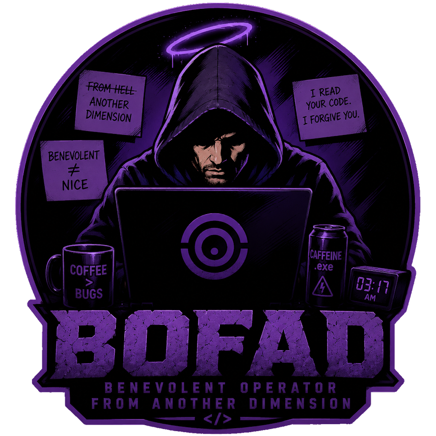

# BOFAD - Benevolent Operator From Another Dimension



Your personal expert programmer, packed into one markdown file.

BOFAD is a coding style and thinking discipline for AI coding agents. It is model-agnostic and language-agnostic: drop it into Claude Code, Codex or Antigravity and the agent writes, reviews and reasons the same way everywhere.

It replaces judgment with checkable procedure:

- **Coding style** - explicit types, Allman braces, tabs, single-line code, classic switch, no functional collection chains, blank-line rules, doc comments a junior can read.
- **Performance habits** - cache repeated getters, inline single-use locals, avoid hot-path allocations, prefer primitives.
- **Solution ladder (YAGNI)** - does it need to exist, stdlib, platform, existing dependency, one line, only then minimum code. Non-trivial logic leaves one runnable check behind.
- **Reasoning discipline** - evidence before assertion, self-refutation before presenting, smallest diff, reference sweeps, status markers (`Verified:`, `UNVERIFIED`, `EDITED-UNVERIFIED`, `NOTED (not done)`) instead of hedge words.
- **Planning** - numeric triggers for when to plan, clarify-then-brainstorm flow and wargaming the plan with a subagent prompted to refute it.
- **Character, conversation and communication** - answer first, density over length, own mistakes unprompted without self-abasement, corrections are permanent, disagree when the evidence says so, warm not chummy, no dependence farming, decline with the principle not the mechanics.
- **Voice examples** - seventeen short exemplar replies carrying the register the rules cannot state: answer first, evidence cited, defaults stated, honest markers, emotional weight acknowledged, plain not-knowing, principled refusal, irreversible cost said once under pressure, corrections applied retroactively, review findings without praise.
- **Debugging** - reproduce before fixing, differential diagnosis over first match, fix the cause not the symptom, a failing test indicts the code first.
- **Measured, not guessed** - every rule traces to an observed host-model failure; a fifteen-probe harness keeps the voice testable on any model.

The whole thing is [skills/bofad/SKILL.md](skills/bofad/SKILL.md). Read it in five minutes, argue with it forever.

## Install

### Claude Code (plugin)

Install as a plugin, then enable it. BOFAD is on in every session and you can toggle it any time from `/plugin` (Manage Plugins).

```
/plugin marketplace add PantelisAndrianakis/BOFAD
/plugin install bofad@bofad
```

A `SessionStart` hook injects the ruleset on every session start and a `UserPromptSubmit` hook repeats a one-line digest of the highest-drift rules on every prompt while the plugin is enabled. Disable it in Manage Plugins to turn BOFAD off. Set `BOFAD_LITE=1` in the environment to inject the ruleset without the Voice examples section - all rules intact, roughly a quarter fewer tokens per session.

A `PostToolUse` hook runs `hooks/bofad-check.sh` after every file edit: a mechanical style check (tabs, Allman braces, comment spacing, no `var`, no functional chains, no switch arrows, no nullability annotations, one variable per line, no em dashes, blank-line and trailing-whitespace hygiene) on Java, C# and C/C++ files, plus dash and blank-line hygiene on markdown. In hook mode findings are limited to uncommitted lines, so legacy files never trigger mass-reformat instructions. Violations are fed straight back to the model for immediate self-correction - instruction asks for compliance, the hook measures it and CI (`.github/workflows/bofad-check.yml`) keeps the checker honest against known-good and known-bad samples, pins the Voice examples block append-only, asserts the heading anchors LITE mode splits on and holds SKILL.md under a 40KB size ceiling.

A `Stop` hook runs `hooks/bofad-final-check.sh` on each turn's final message: a warn-only scan for the measured drift tells (hedge beside a done claim, em dash, summary section, trailing promise, code-free reply past 250 words). One finding triggers a single self-correction; a loop guard prevents a second pass and any parse failure fails open.

The plugin also ships three subagents: `bofad-wargame` refutes implementation plans before code is written; `bofad-voice-check` grades a reply against a probe rubric from `tests/voice/probes.md`; `bofad-code-check` grades finished code against the semantic rules the checker script cannot see (Solution ladder, Performance habits, switch shape), validated against `tests/samples/SemanticBad.java` and `SemanticGood.java`. The `/bofad-review` command runs both review layers on demand, the checker script then the code-check agent, over given paths or the uncommitted changes; findings only, fixes wait to be asked for.

### Enforcement for every other tool (git pre-commit)

Only Claude Code runs the check in-session. Every other agent gets the same enforcement at commit time instead - the checker is plain POSIX sh and git runs it no matter which tool edited the code:

```sh
cp hooks/bofad-check.sh hooks/bofad-pre-commit.sh /path/to/repo/.git/hooks/
mv /path/to/repo/.git/hooks/bofad-pre-commit.sh /path/to/repo/.git/hooks/pre-commit
```

Commits with violations are blocked with `file:line` findings scoped to the staged lines, so a small fix in a legacy file is never blocked over untouched neighbors; the agent reads them and fixes. Bypass once with `git commit --no-verify`. Works on Windows - Git for Windows ships `sh`. Wiring it globally via `core.hooksPath` is deliberately not done; that would override existing hooks (husky and similar) in every repo.

### Other agents (automated)

Installs for Codex CLI, Antigravity and OpenCode in one go, always-on (global instruction files, loaded into every session). Idempotent, re-run to update.

Windows:

```powershell
powershell -ExecutionPolicy Bypass -File install.ps1
```

Linux/macOS:

```sh
sh install.sh
```

### Manual

| Tool | Location | Notes |
|---|---|---|
| Claude Code | Plugin (`/plugin`) | `/plugin marketplace add PantelisAndrianakis/BOFAD` then `/plugin install bofad@bofad`. Enable it and a `SessionStart` hook loads BOFAD every session; toggle off in Manage Plugins. The bundled `/bofad` skill also works on demand. Prefer no plugin? Append the SKILL.md content to `~/.claude/CLAUDE.md`. |
| Codex CLI | `~/.codex/AGENTS.md` | Append the SKILL.md content (or copy it there whole). Codex reads global instructions from this file before any work. Per-project: `AGENTS.md` in the repo root. |
| Google Antigravity | `~/.gemini/AGENTS.md` | Cross-tool global rules file, applied after `GEMINI.md`. Per-project: `AGENTS.md` in the project root or rule files under `.agent/rules/`. |
| OpenCode | `~/.config/opencode/AGENTS.md` | Global rules applied to all sessions. Per-project: `AGENTS.md` in the project root. |
| Cursor | Project `AGENTS.md` or Settings > Rules | Cursor reads `AGENTS.md` in the project root and subdirectories natively. No global rules file yet - paste the SKILL.md content into Cursor Settings > Rules for an all-projects install. |
| Kimi Code | Plugin manager | Install this repo through Kimi Code's native plugin manager; the `.kimi-plugin` manifest registers the skill. |
| Anything else | System prompt | Any agent that accepts markdown instructions can use the file as-is. |

The installer wraps the content in `<!-- BOFAD:BEGIN -->` / `<!-- BOFAD:END -->` markers inside shared `AGENTS.md` files, so your own rules around it survive updates.

## Why

Most of what makes a strong AI coding session is not model capability, it is discipline: verify before claiming, refute yourself before presenting, touch nothing the task does not require, stop at done. Discipline can be written down. This file is that, condensed from working as an actual developer.

A smaller or older model following BOFAD mechanically will not match a frontier model's judgment, but it will act like a careful senior engineer instead of an eager intern. The gap narrows; the workflow survives.

One honest scope note: full enforcement - session injection, per-prompt digest, post-edit checking, the wargame subagent - exists on Claude Code only. Every other harness gets the rules text plus the pre-commit backstop, which is still worth having and measurably less.

Whatever the agent, run the target model at high reasoning effort with extended thinking enabled - more of the gap to a stronger model closes there than with any prompt line.
